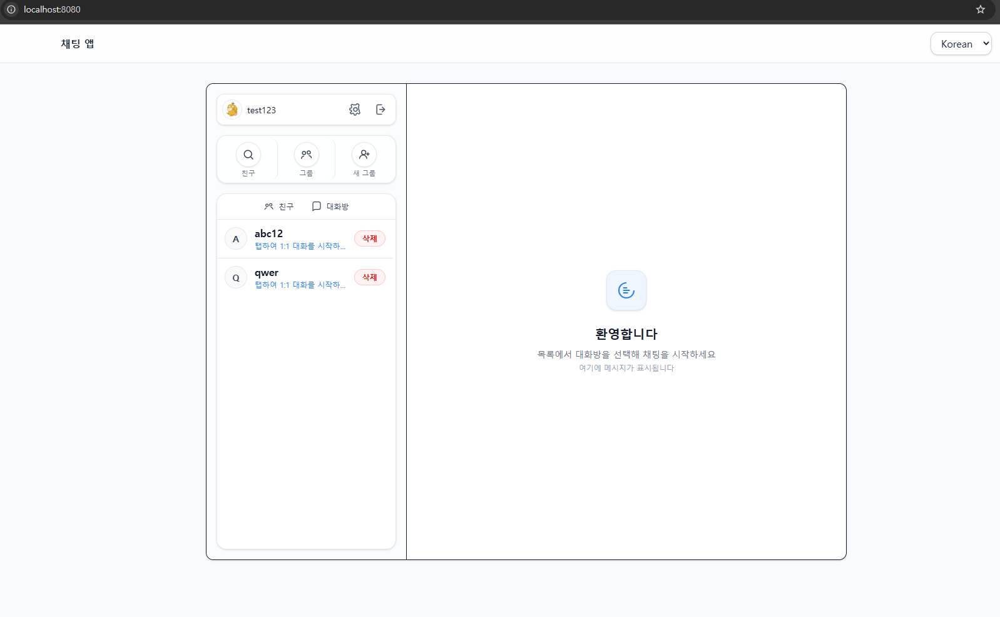

# 💬 Chat System

Spring Boot + Thymeleaf + HTMX + WebSocket(STOMP) 기반의 **실시간 채팅 시스템**

본 프로젝트는 **최소한의 JavaScript로 직관적이고 반응성 있는 채팅 경험**을 제공하는 것을 목표로 합니다.  
단순한 데모를 넘어 **실제 서비스 환경에서도 확장 가능한 구조**를 갖추고 있으며, 다양한 설계 원칙과 패턴을 반영했습니다.

---

## 📌 개요

본 시스템은 전통적인 **MPA(Multi-Page Application)** 기반 구조에  
**HTMX**를 활용하여 불필요한 전체 새로고침 없이 **부분 갱신**을 수행하고,  
**WebSocket(STOMP)**를 통해 실시간 채팅을 제공합니다.

이를 통해 **개발 생산성, 유지보수성, 실시간성**을 균형 있게 달성합니다.

---

## ✨ 주요 기능

- 회원가입 및 로그인, 로그아웃 🔐  
  
    
  

- 내 정보 관리
    - 프로필 이미지, 이름, 상태 메시지 변경 변경
    - 내 프로필 보기
      

- 친구 관리 👥
    - 친구 프로필 조회
    - 내 친구 목록 / 대화방 목록 보기  
        
      
    - 친구 검색, 추가, 삭제  
      

- 그룹 대화방
    - 그룹 대화방 생성 + 대화방 입장코드
    - 그룹 대화방 참여, 나가기
    - 참여자 역할 변경  
      

- 채팅 💬
    - 1:1 및 그룹 채팅  
      
    - 메시지 읽음 처리 👀  
      
    - 채팅방 리스트 자동 정렬 및 최신 메시지 반영  
      

- 부가 기능
    - 스티커 전송 😃  
      
    - 다국어 지원 🌐  
      

---

## 🛠️ 기술 스택

| 영역        | 사용 기술                                                                                                                                                                                                                                                                                |
|-----------|--------------------------------------------------------------------------------------------------------------------------------------------------------------------------------------------------------------------------------------------------------------------------------------|
| Backend   |    |
| Frontend  |                                                                                                                 |
| Real-time |                                                                                                                                       |
| Database  |                                                                                                                                                                                                        |

---

## ⚙️ 동작 원리

### 1. 서버사이드 렌더링 (뷰 로딩)

모든 초기 화면은 `@Controller`에 매핑된 **Thymeleaf 템플릿**으로 렌더링됩니다.

```java

@Controller
public class ViewController {
    @GetMapping
    public String conversation() {
        return "views/conversation";
    }

    @GetMapping("/login")
    public String login() {
        return "views/login";
    }

    @GetMapping("/signup")
    public String signup() {
        return "views/signup";
    }
}
```

---

### 2. HTMX 기반 부분 갱신

특정 UI 영역은 **HTMX** 요청으로 비동기 갱신됩니다.  
예: 대화방 리스트 자동 새로고침

```html

<div hidden="hidden"
     id="refresh-conversation-list"
     hx-trigger="refresh:refresh-conversation-list from:body"
     hx-get="/hx/conversations"
     hx-swap="none"></div>
```

---

### 3. WebSocket(STOMP) 기반 실시간 메시징

메시지 송수신은 STOMP 프로토콜 기반 WebSocket으로 처리됩니다.

```java

@MessageMapping("/conversations/message")
public void receivedMessage(ConversationMessageRequest message, Principal principal) {
    UserId userId = UserId.of(Long.parseLong(principal.getName()));
    conversationMessageService.handleMessage(userId, message.conversationId(), message.message());
}
```

---

### 4. 이벤트 기반 UI 갱신

메시지가 저장되면 이벤트 리스너가 트리거되어, 참여자들의 UI를 최신 상태로 갱신합니다.

```java

@TransactionalEventListener(phase = TransactionPhase.AFTER_COMMIT)
public void handleSystemMessageEvent(SystemMessageEvent event) {
    messagingTemplate.convertAndSendToUser(
            String.valueOf(participantUserId),
            event.socketDestination(),
            renderedHtml,
            headers
    );
}
```

---

## 📂 프로젝트 구조

```
FE
 ├─ views        # URL과 매핑되는 페이지 템플릿
 ├─ components   # HTMX 요청 응답 템플릿
 └─ fragments    # 재사용 가능한 HTML 조각

BE
 ├─ common       # 공통 모듈(상수, 유틸, 에러 처리 등)
 ├─ config       # 설정 파일
 ├─ domain       # Entity, Repository
 ├─ service      # 비즈니스 로직
 ├─ controller   # 컨트롤러
 │   ├─ socket   # WebSocket 전용 컨트롤러
 │   ├─ view     # 뷰 페이지 매핑
 │   ├─ api      # JSON API
 │   └─ hx       # HTMX 요청 처리
```

---

## 🧩 설계적 고민 & 해결 방법

- **템플릿 관리 전략**
    - `views`: 페이지 단위 화면
    - `components`: HTMX 응답 UI 조각
    - `fragments`: 재사용 가능한 공통 HTML

- **다중 fragment 응답 처리**
    - `ModelAndViewBuilder`를 도입하여 하나의 요청에 여러 fragment 반환 가능

- **일관된 UI 동작 처리**
    - 공통 토스트 알림(`toast-container`)
    - 리다이렉트(`HX-REDIRECT`), 리로드(`HX-RELOAD`)
    - 사용자 UI 리프레시(`USER_UI_REFRESH_IDS` 헤더)

- **안전성과 가독성 확보**
    - 주요 식별자는 값 객체(`UserId`, `ConversationId`)로 정의
    - 메서드 파라미터는 중요도 순으로 정렬
    - 코드값은 `enum`, 상수는 `Constants` 클래스에서 관리
    - `ExceptionHandler`를 API/HTMX 요청별로 구분 적용
    - Thymeleaf 템플릿에 파라미터 주석을 명시하여 IDE 지원 강화

- **국제화(I18n)**
    - 다국어 메시지 리소스를 관리하여 글로벌 환경 지원

---

## 🚀 실행 방법

```bash
gradle bootRun
```

- DB: MySQL 실행 필요
- OpenAPI 문서: `/swagger-ui.html`

---

## 📜 라이선스

MIT

---

## 🔍 핵심 가치

- 단순히 동작하는 채팅이 아니라 **확장성과 유지보수성을 고려한 구조**
- 최소한의 JS로도 **실시간성 있는 사용자 경험 제공**
- FE 협업을 고려한 **체계적인 템플릿 구조 관리**
- **이벤트 기반 설계**로 메시지 송수신과 UI 갱신을 깔끔하게 분리
