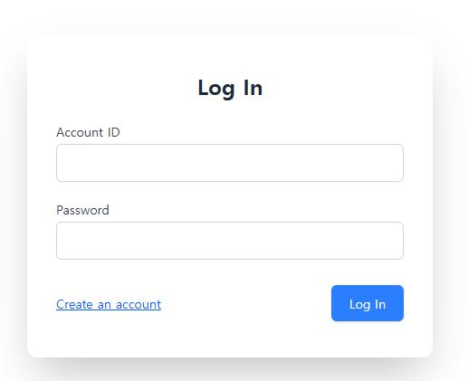
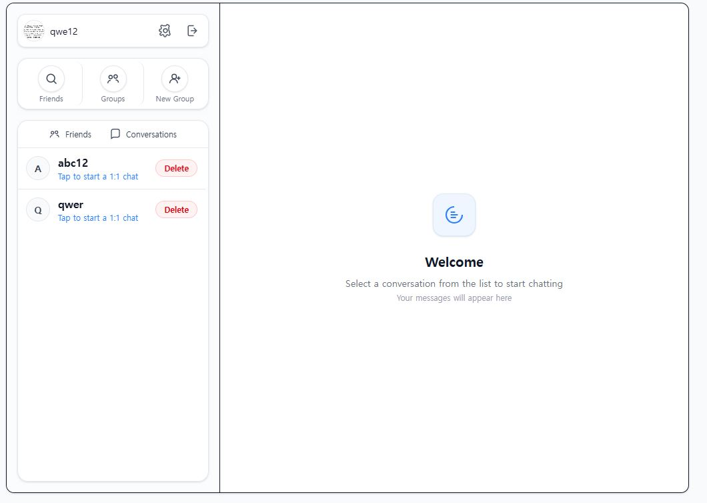
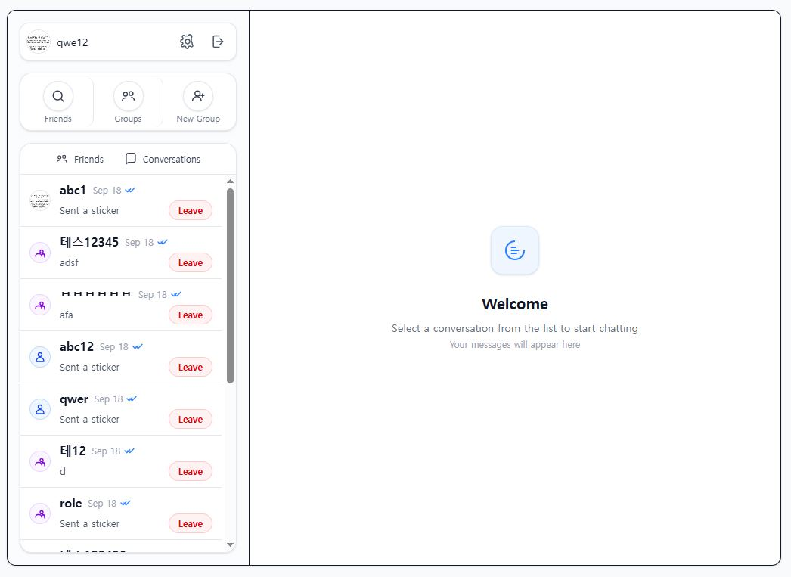
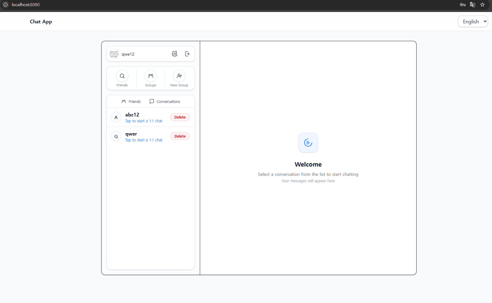
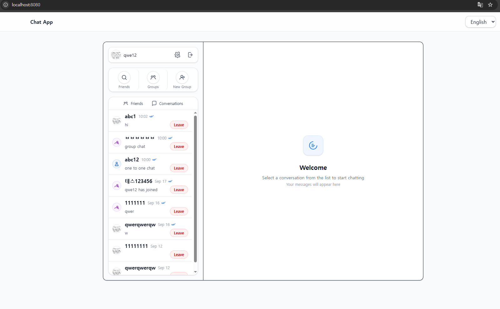
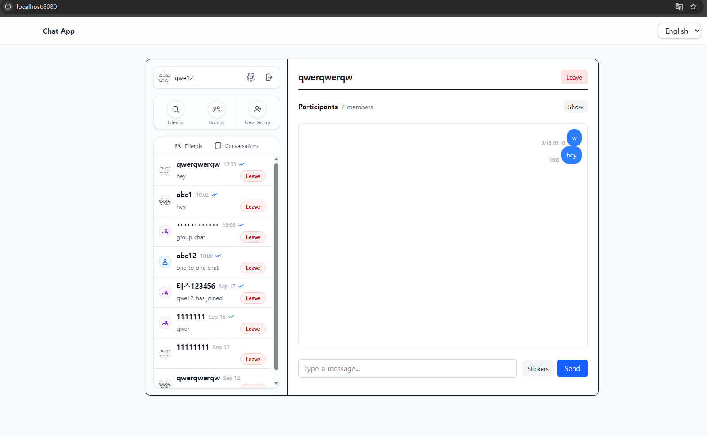

# 💬 Chat System

Spring Boot + Thymeleaf + HTMX + WebSocket(STOMP) 기반의 **실시간 채팅
시스템**

본 프로젝트는 **최소한의 JavaScript로도 직관적이고 반응성 있는 채팅
경험**을 목표로 설계되었습니다.\
단순한 데모 수준을 넘어, 실제 서비스 환경에서도 확장 가능하도록 다양한
구조적 고민과 설계 원칙이 반영되어 있습니다.

------------------------------------------------------------------------

## 📌 개요

본 시스템은 전통적인 **MPA(Multi-Page Application)** 구조를 기반으로
하되, **HTMX**를 활용하여 불필요한 페이지 새로고침 없이 필요한 영역만
갱신하고,

**WebSocket(STOMP)**를 통해 실시간 채팅을 지원합니다.\
이러한 조합은 "**개발 생산성, 유지보수성, 실시간성**"이라는 세 가지
목표를 균형 있게 달성합니다.

------------------------------------------------------------------------

## ✨ 주요 기능

- 회원가입 및 로그인 🔐




- 내 친구목록 / 대화방 목록 보기
  
  

- 친구 검색, 추가 및 삭제 👥
  

- 그룹 대화방 생성, 참여, 나가기, 회원 역할 변경
  

- 1:1 및 그룹 채팅 💬
  

- 메시지 읽음 처리 👀
  

- 채팅방 리스트 자동 정렬 및 마지막 메시지 반영
  

- 스티커 전송 😃
  

- 다국어 지원 🌐
  

------------------------------------------------------------------------

## 🛠️ 기술 스택

  --------------------------------------------------------------------------------------------------------------------
영역 사용 기술
  ----------- --------------------------------------------------------------------------------------------------------
Backend     


Frontend    


Real-time   


Database    
--------------------------------------------------------------------------------------------------------------------

------------------------------------------------------------------------

## ⚙️ 동작 원리

### 1. 뷰 로딩 (서버사이드 렌더링)

모든 페이지는 `@Controller`를 통해 URL과 매핑되며, 초기 화면은 Thymeleaf
템플릿으로 렌더링됩니다.

``` java
@Controller
public class ViewController {
    @GetMapping
    public String conversation() { return "views/conversation"; }

    @GetMapping("/login")
    public String login() { return "views/login"; }

    @GetMapping("/signup")
    public String signup() { return "views/signup"; }
}
```

### 2. HTMX 기반 부분 갱신

화면 내 특정 영역은 **HTMX**를 통해 비동기적으로 갱신됩니다.\
예를 들어, 대화방 리스트는 이벤트 트리거에 따라 자동으로 새로고침됩니다.

``` html
<div hidden="hidden"
     id="refresh-conversation-list"
     hx-trigger="refresh:refresh-conversation-list from:body"
     hx-get="/hx/conversations"
     hx-swap="none"></div>
```

모달, 알림창 등도 동일한 방식으로 동작합니다.

### 3. WebSocket 기반 실시간 메시징

메시지 전송 및 수신은 STOMP 기반 WebSocket으로 처리됩니다.

``` java
@MessageMapping("/conversations/message")
public void receivedMessage(ConversationMessageRequest message, Principal principal) {
    UserId userId = UserId.of(Long.parseLong(principal.getName()));
    conversationMessageService.handleMessage(userId, message.conversationId(), message.message());
}
```

### 4. 이벤트 기반 UI 갱신

메시지가 저장되면 **이벤트 핸들러**가 자동으로 실행되어, 참여자들의 UI를
최신 상태로 갱신합니다.

``` java
@TransactionalEventListener(phase = TransactionPhase.AFTER_COMMIT)
public void handleSystemMessageEvent(SystemMessageEvent event) {
    messagingTemplate.convertAndSendToUser(
        String.valueOf(participantUserId),
        event.socketDestination(),
        renderedHtml,
        headers
    );
}
```

------------------------------------------------------------------------

## 📂 프로젝트 구조

    FE
     ├─ views        # URL과 매핑되는 페이지 템플릿
     ├─ components   # HTMX 요청 응답 템플릿
     └─ fragments    # 재사용 가능한 HTML 조각

    BE
     ├─ common       # 공통 모듈(상수, 유틸, 에러 처리 등)
     ├─ config       # 설정 파일
     ├─ domain       # Entity, Repository
     ├─ service      # 비즈니스 로직
     ├─ controller   # 컨트롤러
     │   ├─ socket   # WebSocket 전용 컨트롤러
     │   ├─ view     # 뷰 페이지 매핑
     │   ├─ api      # JSON API
     │   └─ hx       # HTMX 요청 처리

------------------------------------------------------------------------

## 🧩 설계적 고민 & 해결 방법

- **템플릿 관리 전략**
- `views`: 페이지 단위 화면
- `components`: HTMX 요청 시 반환되는 UI 조각
- `fragments`: 재사용을 위한 공통 HTML
- **다중 fragment 응답 처리**
- `ModelAndViewBuilder`를 도입하여, 하나의 요청에 여러 fragment를
  반환
- **일관된 UI 동작 처리**
- 공통 토스트 알림(`toast-container`)
- 리다이렉트(`HX-REDIRECT`) 및 리로드(`HX-RELOAD`) 처리
- 사용자 UI 리프레시(`USER_UI_REFRESH_IDS` 헤더)
- **안전성과 가독성 확보**
- 주요 식별자는 값 객체(`UserId`, `ConversationId`)로 정의
- 메서드 파라미터는 중요도 순서로 정렬
- 코드값은 `enum`, 상수는 `Constants` 클래스에서 관리
- `ExceptionHandler`를 API/HTMX 요청별로 구분 적용
- Thymeleaf 템플릿은 필요한 파라미터를 주석으로 명시하여 IDE 지원
  강화
- **국제화(I18n)**
- 다국어 메시지 리소스를 관리하여 글로벌 환경에서도 서비스 가능

------------------------------------------------------------------------

## 🚀 실행 방법

``` bash
gradle bootRun
```

- DB: MySQL 실행 필요
- OpenAPI 문서: `/swagger-ui.html`

------------------------------------------------------------------------

## 📜 라이선스

MIT

------------------------------------------------------------------------

## 🔍 이 프로젝트에서 중요하게 생각한 점

- "단순히 동작하는 채팅"이 아니라 **유지보수성과 확장성을 고려한
  구조**
- 최소한의 JS로도 **실시간성 있는 경험**을 줄 수 있는 방법 탐구
- FE 개발자와 협업을 고려하여 **템플릿 구조를 체계적으로 관리**
- **이벤트 기반 설계**로 메시지 송수신과 UI 갱신을 깔끔하게 분리
